# TP13 — Évaluation Docker

Stack Docker complète : API Node.js (Express + prom-client), reverse proxy Nginx avec load balancing, registry privé, observabilité (Prometheus, Grafana, node-exporter, cAdvisor), Portainer, CI/CD GitHub Actions et déploiement sur VPS.

- **VPS** : `78.138.58.50`
- **API publique** : http://78.138.58.50:40110/
- **Prometheus** : http://78.138.58.50:40112/
- **Grafana** : http://78.138.58.50:40111/ (admin / admin)
- **Portainer** : http://78.138.58.50:40115/
- **Registry privé** : `127.0.0.1:5000` (accès local au VPS uniquement)

---

## Partie 1 — API & Dockerfile

L'API Node.js (`api/app.js`) expose :

- `GET /` → `{ hostname, pet, requests }` (compteur incrémenté à chaque requête).
  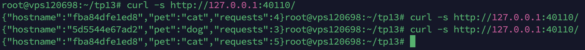

- `GET /healthz` → `{ "status": "ok" }`, HTTP 200.

- `GET /metrics` → métriques Prometheus exposées via `prom-client`.

Le Dockerfile (`api/Dockerfile`) utilise `node:20-alpine`, exécute l'application en utilisateur non-root (`nodeuser`), installe les dépendances avec `npm install --only=production` et configure un `HEALTHCHECK` sur `/healthz`.

Le fichier `.dockerignore` exclut `node_modules`, `.env`, `.git` et `npm-debug.log`.

**Preuve `GET /` :**

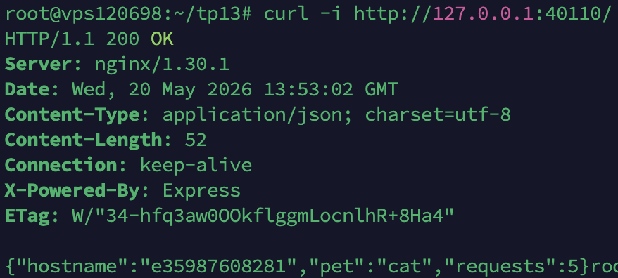

**Preuve `GET /healthz` :**

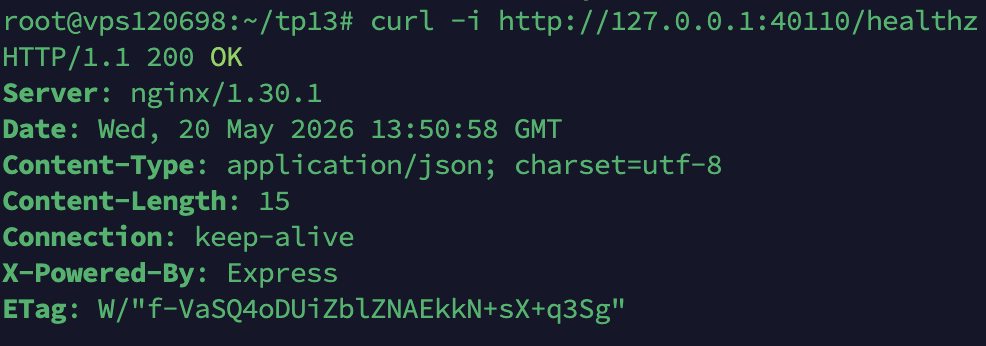

---

## Partie 2 — Registry privé

`docker-compose.registry.yml` lance un service `registry:2` et l'interface `joxit/docker-registry-ui`. Les binds IP sont configurables via `.env` (`REGISTRY_BIND_IP`, `REGISTRY_UI_BIND_IP`) : le registry peut rester local tandis que l'UI peut etre exposée.

L'image API est buildée puis poussée vers `127.0.0.1:5000/mon-api:1.0.0`, et le `docker-compose.yml` principal référence cette image via la variable `${API_IMAGE_LOCAL}` :

```yaml
services:
  cat:
    image: ${API_IMAGE_LOCAL} # localhost:5000/mon-api:1.0.0
```

**Image listée dans le registry privé :**

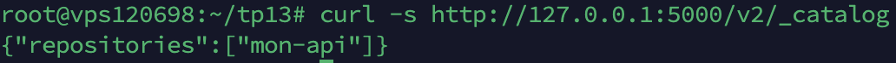

Capture de l'API du registry exposant le repository `mon-api`.

---

## Partie 3 — Stack Compose & Nginx

Le `docker-compose.yml` orchestre trois services sur le réseau personnalisé `tp13_net` :

- **`cat`** : API avec `PET=cat`, **aucun port exposé sur l'hôte**.
- **`dog`** : API avec `PET=dog`, **aucun port exposé sur l'hôte**.
- **`nginx`** : reverse proxy, seul service à publier un port (`${NGINX_PORT}:80`).

Les services `cat` et `dog` ont un `healthcheck` sur `/healthz`. Le service `nginx` utilise `depends_on` avec `condition: service_healthy` pour ne démarrer qu'une fois les deux APIs prêtes.

**Configuration Nginx (`nginx/default.conf`) :**

```nginx
upstream pets_backend {
    server cat:3000;
    server dog:3000;
}

server {
    listen 80;

    location = / {
        proxy_pass http://pets_backend;       # round-robin cat/dog
    }
    location = /healthz {
        proxy_pass http://pets_backend/healthz;
    }
    location = /cat {
        proxy_pass http://cat:3000/;          # cat uniquement
    }
    location = /dog {
        proxy_pass http://dog:3000/;          # dog uniquement
    }
}
```

---

## Partie 4 — Sécurité

**Scan Trivy (CVE CRITICAL) :**

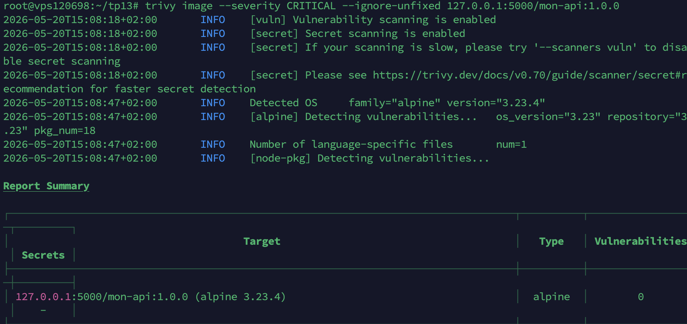

Aucune vulnérabilité CRITICAL détectée sur l'image `mon-api:1.0.0` (base `alpine 3.23.4`, 18 paquets analysés).

**Justification de `node:20-alpine` :**

- Image Alpine Linux ~50 Mo vs ~350 Mo pour `node:latest` (Debian).
- Surface d'attaque réduite : moins de paquets installés = moins de CVE potentielles.
- Tag spécifique `20-alpine` (vs `latest` flottant) garantit la reproductibilité du build.
- Scan Trivy : 0 CVE CRITICAL sur l'image finale.

**Configuration par `.env`** : tous les ports, identifiants Grafana, noms d'images et valeurs `PET` sont externalisés dans `.env`. Aucune valeur n'est en dur dans les Compose ni le Dockerfile (hors valeurs par défaut techniques comme `API_PORT=3000`).

**Dockerfile optimisé** :

```dockerfile
COPY package*.json ./        # 1) deps en premier → cache Docker
RUN npm install --only=production
COPY app.js ./               # 2) code après (invalide moins de couches)
```

Le `.dockerignore` empêche `node_modules` d'entrer dans le contexte de build.

---

## Partie 5 — Validation

**`docker compose ps` tous services Up (healthy) :**

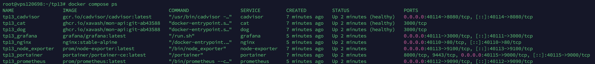

**Load balancing round-robin sur `/`** (deux appels successifs, hostnames différents) :

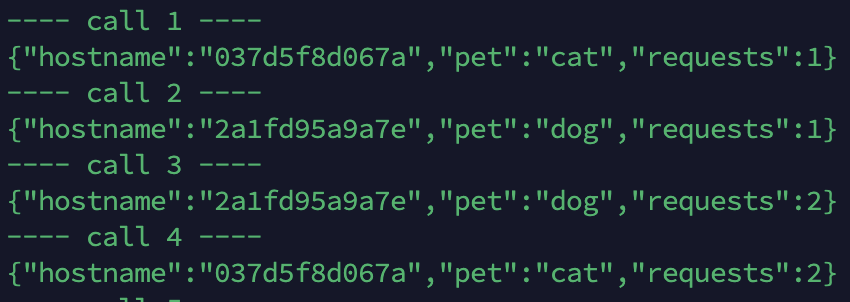

**`/cat` → `PET: cat`, `/dog` → `PET: dog`** avec compteurs distincts :

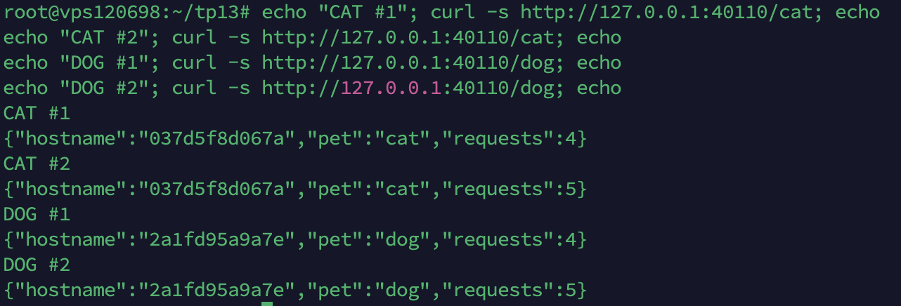

---

## Partie 6 — Questions théoriques

### Question Swarm

**`docker compose up`** déploie la stack sur un **unique hôte Docker** : il lit le `docker-compose.yml`, build les images localement si `build:` est défini, et lance les conteneurs en local.

**`docker stack deploy`** déploie la stack en **mode Swarm** sur un **cluster** de nœuds : la stack est distribuée, répliquée et orchestrée par les managers Swarm. Le format des fichiers est compatible avec quelques limitations.

La directive **`build:` n'est pas utilisable** dans `docker stack deploy` car les nœuds Swarm ne partagent pas le contexte de build local du manager. Les nœuds doivent récupérer une image déjà construite depuis un **registry accessible** (Docker Hub, GHCR, ou registry privé). On doit donc builder d'abord (`docker build` + `docker push`), puis référencer l'image avec `image:` uniquement.

### Question Secrets

Une **variable d'environnement** est visible dans la définition du conteneur (`docker inspect`), dans l'environnement du process, et risque d'apparaître dans les logs ou crashs. Tout process du conteneur y a accès.

Un **Docker Secret** (Swarm ou compose v3.1+) est monté en lecture seule dans le fichier **`/run/secrets/<nom_du_secret>`** à l'intérieur du conteneur. Il n'est jamais exposé via `docker inspect` ni dans l'environnement.

**Lecture depuis Node.js** :

```js
const fs = require("fs");
const dbPassword = fs.readFileSync("/run/secrets/db_password", "utf8").trim();
```

### Question Backup

**À sauvegarder impérativement (irremplaçable) :**

- **Volumes nommés contenant des données métier** : base de données, fichiers utilisateurs, données Grafana (dashboards créés manuellement), données du registry, données Portainer.
- **Fichiers de configuration versionnés** (Compose, `.env` de prod, configs Nginx/Prometheus/Grafana provisionnés).
- **Secrets** (mots de passe, clés TLS, tokens).

**Recréable automatiquement** :

- Les **images Docker** (rebuild depuis le Dockerfile et push registry).
- Les **conteneurs** (recréés depuis `docker compose up`).
- Les **réseaux Docker** (recréés depuis Compose).
- Les **dépendances applicatives** (`npm install` from `package*.json`).

Une stratégie de sauvegarde efficace combine : versionnement Git (code + Compose + provisioning) + backup régulier des volumes nommés via `docker run --rm -v vol:/data -v $(pwd):/backup alpine tar cz /data`.

---

## Partie 7 — Observabilité & Production

La stack inclut :

- **Prometheus** scrape `cat`, `dog`, `node-exporter` et `cadvisor` (config dans `monitoring/prometheus/prometheus.yml`).
- **Grafana** avec datasource Prometheus **provisionnée automatiquement** (`monitoring/grafana/provisioning/datasources/prometheus.yml`) et dashboard TP13 auto-chargé (`monitoring/grafana/dashboards/tp13-overview.json`).
- **node-exporter** : métriques système.
- **cAdvisor** : métriques par conteneur.
- **Portainer** : UI de gestion Docker accessible sur `:40115`.

Le `docker-compose.prod.yml` est un **fichier override** appliqué via `-f docker-compose.yml -f docker-compose.prod.yml`. Il ajoute uniquement les ajustements production : **limites CPU/RAM** (`mem_limit`, `cpus`), `restart: always` et override de l'image API vers GHCR.

Commande de déploiement production :

```bash
export GIT_SHA=<short_sha>
docker compose --env-file .env \
  -f docker-compose.yml -f docker-compose.prod.yml \
  up -d
```

**Cibles Prometheus toutes UP :**

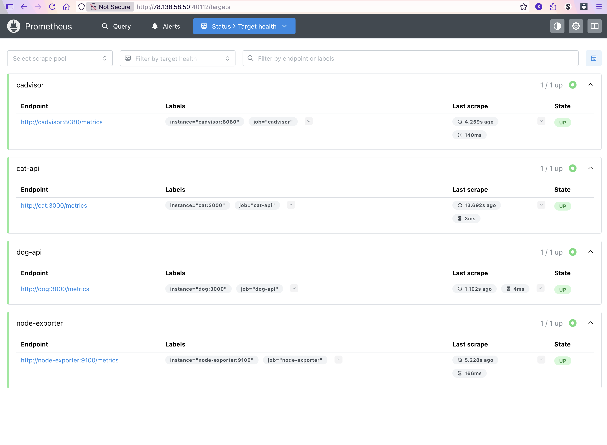

**Dashboard Grafana provisionné :**

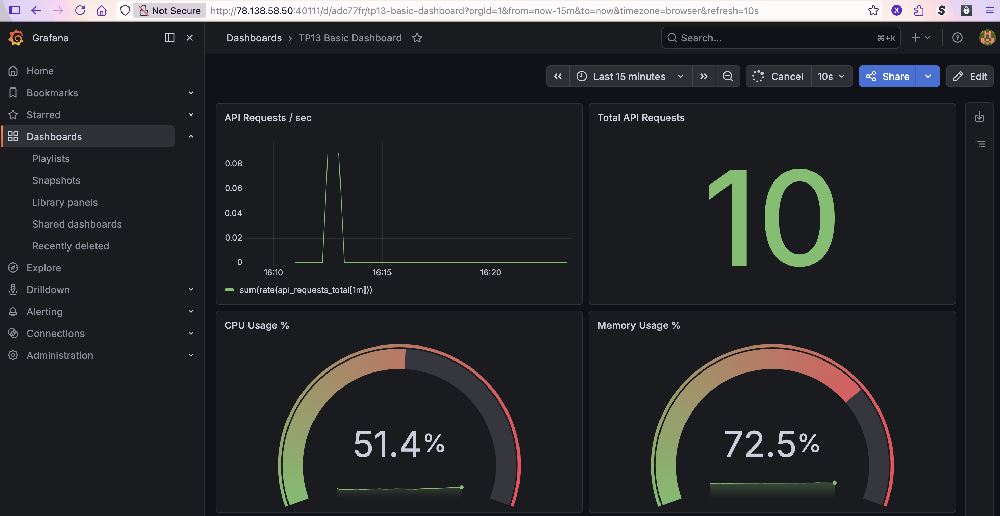

**Portainer accessible :**

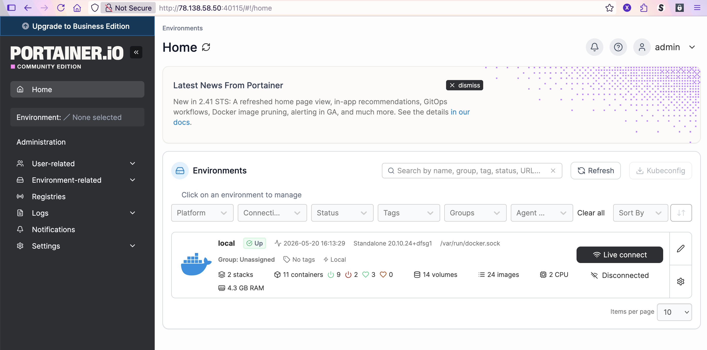

---

## Partie 8 — Volumes

**Volumes nommés** (données persistantes) :

- `grafana_data` → données Grafana
- `portainer_data` → données Portainer
- `registry_data` → images du registry privé

**Bind mounts** (configs versionnées dans le repo) :

- `./nginx/default.conf` → `/etc/nginx/conf.d/default.conf` (reverse proxy)
- `./monitoring/prometheus/prometheus.yml` → config Prometheus
- `./monitoring/grafana/provisioning/...` → datasources + dashboards Grafana

**Justification :** les volumes nommés sont gérés par Docker, persistent indépendamment des conteneurs et sont faciles à sauvegarder. Les bind mounts permettent de versionner les configs dans Git et d'éditer directement depuis le repo.

**`docker volume ls` :**

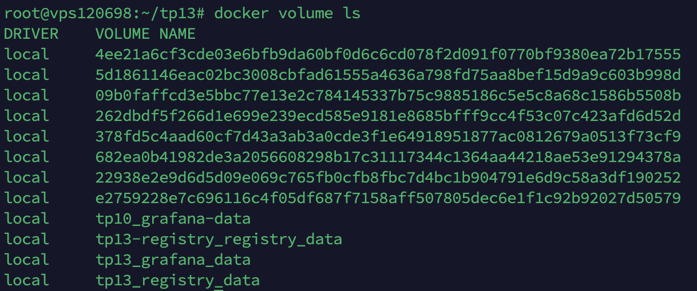

**`docker volume inspect tp13_grafana_data` :**

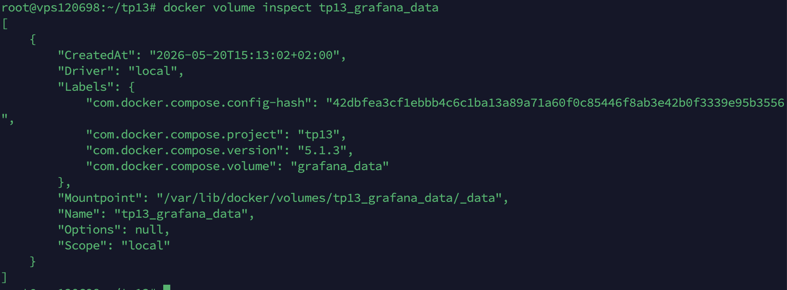

---

## Partie 9 — CI/CD GitHub Actions

Le workflow `.github/workflows/docker.yml` se déclenche sur **push sur `main`** et exécute :

1. **Build** de l'image API depuis `api/Dockerfile`.
2. **Scan Trivy** (`severity: CRITICAL`, `exit-code: 1`) → pipeline rouge si une CVE CRITICAL est détectée.
3. **Push** sur GHCR avec tag `git-<short_sha>` : `ghcr.io/xavash/mon-api:git-<sha>`.
4. **Deploy SSH** sur le VPS : pull de l'image + `docker compose up -d` + smoke test `curl`.

**Pipeline en succès :**

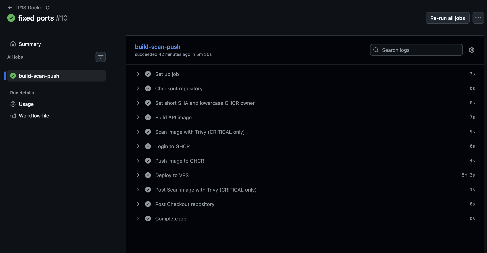

Run `#10` (`fixed ports`) — toutes les étapes vertes : build, Trivy CRITICAL, push GHCR, deploy VPS.

---

## Partie 10 — Déploiement VPS

Stack accessible publiquement sur **`78.138.58.50`** :

| Service        | URL                                              |
| -------------- | ------------------------------------------------ |
| API (Nginx LB) | http://78.138.58.50:40110/                       |
| `/cat`         | http://78.138.58.50:40110/cat                    |
| `/dog`         | http://78.138.58.50:40110/dog                    |
| Prometheus     | http://78.138.58.50:40112/                       |
| Grafana        | http://78.138.58.50:40111/ (admin/admin)         |
| Portainer      | http://78.138.58.50:40115/ (admin/admin123456789 |

**`docker compose ps` sur le VPS — tous services Up (healthy) :**


---

## Partie 11 — Structure du projet

```text
tp13/
├── .github/workflows/docker.yml      # CI/CD : build + Trivy + push GHCR + deploy SSH
├── api/                              # API Node.js + Dockerfile + .dockerignore
├── nginx/default.conf                # reverse proxy + load balancer
├── monitoring/
│   ├── prometheus/prometheus.yml
│   └── grafana/
│       ├── provisioning/datasources/
│       ├── provisioning/dashboards/
│       └── dashboards/tp13-overview.json
├── scripts/                          # helpers (start-registry, deploy, verify-stack)
├── captures/                         # preuves visuelles par partie
├── docker-compose.yml                # stack de base (utilisée seule en dev, ou + override prod)
├── docker-compose.prod.yml           # OVERRIDE prod : image GHCR + limites CPU/RAM
├── docker-compose.registry.yml       # registry privé + UI (127.0.0.1)
├── .env                              # toutes les variables d'environnement
└── README.md                         # ce fichier
```
