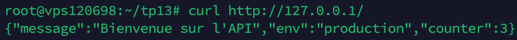

TP13 : Évaluation Docker

Partie 1

Partie 2

Rendu attendu pour cette partie : une capture d'écran de l'interface web (http://localhost:8080) montrant votre image listée dans le registry, et le champ image: de votre docker-compose.yml principal pointant vers localhost:5000/... (visible dans le fichier versionné dans le repo).

Partie 3

Partie 4

Rendu attendu pour cette partie : une capture d'écran d'une partie de la sortie de trivy image <votre-image> dans le dossier captures/, et la justification du choix d'image.

Partie 5

Rendu attendu pour cette partie : quatre captures d'écran dans le dossier captures/, correspondant aux critères ci-dessous.

Partie 6 Questions

    Question Swarm (1 pt) : Expliquez la différence entre docker compose up et docker stack deploy. Pourquoi la directive build: n'est-elle pas utilisable dans une stack déployée en mode Swarm ?
    Question Secrets (1 pt) : Expliquez la différence entre passer un mot de passe via une variable d'environnement et via un Docker Secret. Dans quel fichier le secret est-il accessible à l'intérieur du conteneur, et comment le lire depuis du code Node.js ?
    Question Backup (1 pt) : Dans une architecture Docker en production, quels éléments faut-il impérativement sauvegarder pour pouvoir reconstruire entièrement la stack après une panne ? Distinguez ce qui est recréable automatiquement de ce qui est irremplaçable.

Partie 8

Rendu attendu pour cette partie : une capture de docker volume ls montrant les volumes nommés de votre stack, et une capture de docker volume inspect <volume> sur l'un d'eux.

Partie 9

Rendu attendu pour cette partie : le fichier .github/workflows/docker.yml versioné dans le dépôt, et une capture d'écran de l'onglet Actions de GitHub montrant le pipeline en succès (ou en échec justifié si des CVE CRITICAL sont présentes).

Partie 10

Si l'ensemble de votre stack est déployée et accessible depuis un VPS (serveur distant), vous obtenez les points de cette partie. Fournissez l'URL ou l'IP publique dans le README.md, ainsi qu'une capture montrant la stack fonctionnelle depuis le serveur.

Partie 11

Clarté & lisibilité du README
Le README.md est le fichier rendu qui centralise votre travail. Il doit être structuré, lisible et permettre de retrouver rapidement les preuves attendues.
